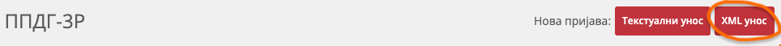

# Quick Start

Automated generation of PPDG-3R (Capital Gains Tax) and PP OPO (Capital Income Tax) reports for Interactive Brokers users in Serbia.
The app automatically retrieves transaction data and creates a ready-to-upload XML file, converting all prices to dinars (RSD).

[Install ibkr-porez ↗](installation.md)

If you use the graphical interface, configure your data (the `Config` button), then just use `Sync` to refresh data and create declarations.

If you installed GUI + CLI, you can use both the graphical interface (starts as `ibkr-porez` without arguments) and the command line, see below.

The GUI and CLI use the same database.

> ⚠️ While the GUI is running, do not use the command line,
> as simultaneous usage may cause database errors.

If you want to do everything via command line, continue with:

- [Configuration (config) ↗](usage.md#configuration-config)
- [Import Historical Data (import) ↗](usage.md#import-historical-data-import)

> ⚠️ **Import is only necessary if you have more than one year of transaction history in Interactive Brokers.** Flex Query allows downloading data for no more than the last year, so older data must be loaded from a [full CSV export ↗](ibkr.md#export-full-history-for-import-command).

### Quickly create the required declaration

If you want to quickly create a specific declaration.

[Fetch Latest Data (fetch) ↗](usage.md#fetch-data-fetch)

[Generate Report (report) ↗](usage.md#generate-tax-report-report)

Upload the generated XML to the **ePorezi** portal (PPDG-3R section).

### Automatic declaration creation

If you want to automatically receive all required declarations and track their status (submitted, paid).

[Fetch latest data and create declarations (sync) ↗](usage.md#sync-data-and-create-declarations-sync)

[Declaration Management ↗](usage.md#declaration-management)
